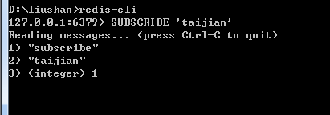
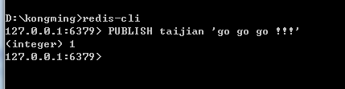
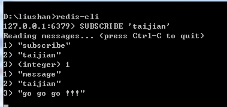
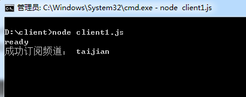
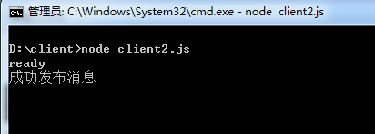
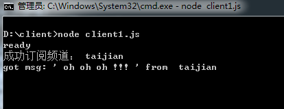
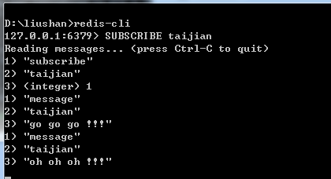

## 不同node应用之间的消息传递
> 基于windows环境，使用node实现，此处介绍两种方式。
### 0.使用 redis 的pub/sub机制作辅助
> 如若没有安装使用,或者不大了解 --> [请点我][1]
##### 先看看redis 的pub/sub
1. 打开两个终端暂且成为kongming 和 liushan，输入redis-cli进入redis环境
2. 在终端 liushan，使用subscribe进行订阅来自渠道：'taijian' 的消息 
  效果如图： <br>
  
3. 在终端 kongming，通过taijian渠道，使用publish发布消息："go go go !!!"
  终端 kongming： <br>
  
4. 这时在终端 liushan就会收到消息
  终端 liushan： <br>
  
5. 用这么个简单例子介绍下redis 的pub/sub

##### 两个不同的node应用如何利用redis进行传递消息
1. 建立两个js文件 client1.js、client2.js
> 此处相对于redis来说，node 应用应属于客户端，client1 和 client2可互为发布订阅方，这里考虑client1为订阅方，client2为发布方的情况。
2. 两个文件都与redis建立连接，并且client1订阅消息，client2发布消息
	- client1 代码如下：
	``` javascript
		var redis = require("redis");
		var client = redis.createClient(6379, '127.0.0.1', '', {} );
		client.on("ready",function(err){
			console.log("ready")
		})
		// 支持同步
		client.subscribe("taijian")
		client.on("subscribe",function(channel,count){
			console.log('成功订阅频道：',channel)
		})
		client.on("message", function(channel,msg) {
			console.log("got msg: '",msg,"' from ", channel)
		})
	```
	- client2 代码如下：
	``` javascript 
		var redis = require("redis");
		var client = redis.createClient(6379, '127.0.0.1', '', {});
		client.on("ready",function(err){
			console.log("ready")
		})
		// 支持同步
		client.publish("taijian",'oh oh oh !!!',function(){
			console.log("成功发布消息")
		})
	```
3. 运行代码需要先订阅。
	- 运行代码client1，终端结果如下： <br>
	

	- 运行代码client2，client1、client2、liushan三个终端都将有新的打印信息 <br>
	client2终端，提示已发布消息： <br>
	 <br>
	client1终端，提示已收到消息： <br>
	 <br>
	liushan终端，提示已收到消息： <br>
	 <br>
### 
**至此，一个简单的基于redis的方式已经完成，还有就是，client1也可以使用不同渠道发布消息，而client2也可以使用该渠道进行接收**
##### 

[1]:http://www.runoob.com/redis/redis-install.html
